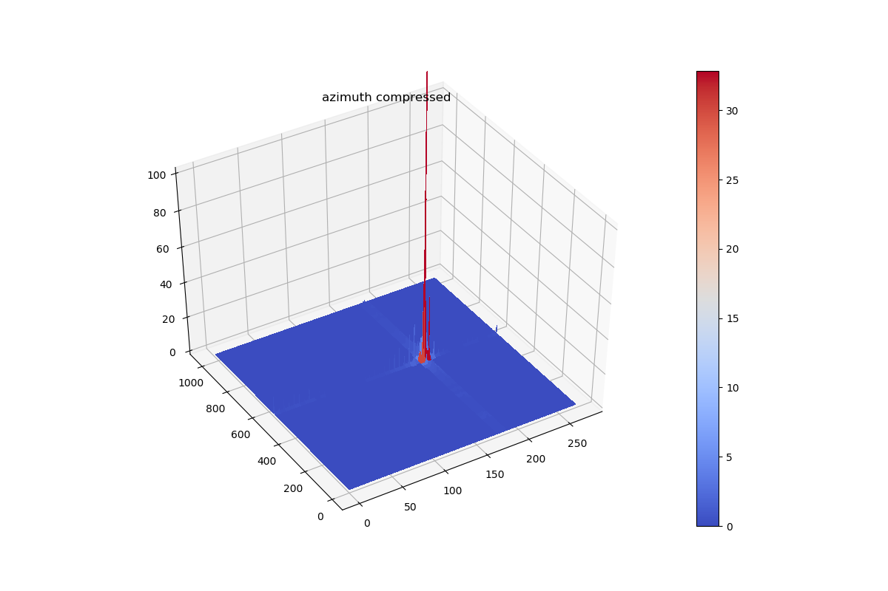
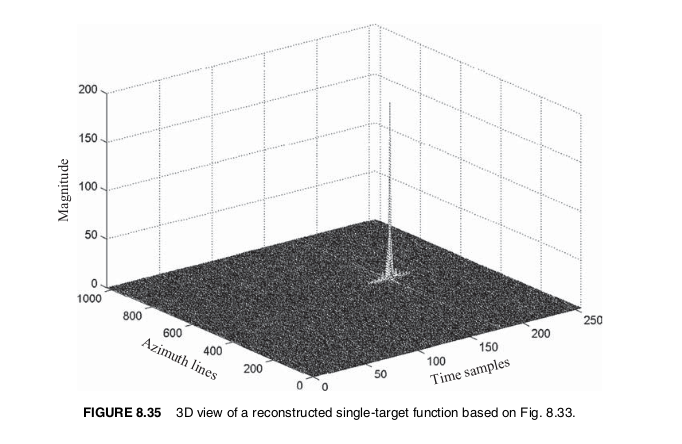

# SAR_textbook_simulation
The following git repository did a great job doing simulations based on the book: Digital Signal Processing Techniques and Applications in Radar Image Processing by Bu-Chin Wang:
https://github.com/sanja7s/SAR-raw-data-simulator

However, some of the simulations in the text haven't been completed. I have updated their codes and completed simulations of Section 8.5.1, Broadside SAR with Single Target.

